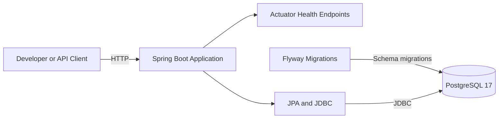
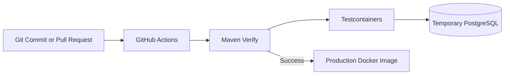

# Current Architecture

This document describes the architecture implemented at the end of Phase 0.
It intentionally shows only existing components. Planned AI capabilities are
documented in the project roadmap and are not presented as implemented.

## Runtime architecture



The application can run directly from IntelliJ IDEA or as a Docker container.
PostgreSQL runs locally through Docker Compose.

## Build and test architecture



Integration tests do not depend on the developer's local PostgreSQL instance.
Testcontainers creates an isolated database, and Flyway applies the production
migrations before assertions are executed.

## Deployment unit

The application is currently one modular Spring Boot deployment unit:

```text
dev-assist-ai.jar
```

The production container contains:

- a Java 21 runtime;
- the executable application JAR;
- a non-root `app` user.

It does not contain Maven, source code, or build tools.

## Implemented components

- Spring Boot application;
- PostgreSQL persistence infrastructure;
- Flyway schema migrations;
- Actuator health endpoints;
- Docker Compose development database;
- Testcontainers integration testing;
- multi-stage production Docker image;
- GitHub Actions verification and image build.

## Planned components

The following components are not implemented yet:

- incident REST API;
- LLM integration;
- structured AI output;
- embeddings and vector search;
- retrieval-augmented generation;
- operational tools;
- MCP;
- agentic workflow;
- production cloud deployment.

They will be added incrementally when their product use cases are implemented.